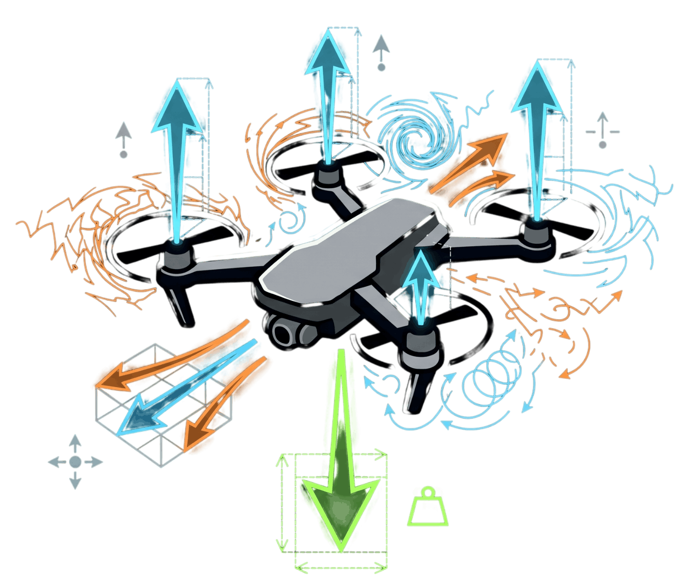

<div align="center">
  
</div>

# QuadSim

Browser-based quadcopter simulation and flight-control lab: **mission planner** (timeline keyframes), Rust/WebAssembly physics, Vite dashboard, Three.js view, and telemetry charts.

## Demo

[Demo Video](https://github.com/user-attachments/assets/bfc97819-52d0-4e4a-b1be-28fd821d49f2)

## Mission planner

The UI **Mission Timeline** panel lets you add and edit timed events—attitude **setpoints** (altitude, roll, pitch, yaw), **front flip**, and **helix** maneuvers. The timeline is serialized into the Rust controller (`src/wasm_api.rs` → `MissionAction`) and drives the live simulation, 3D view, and charts.

## Model

**Setup:** X-quad, thrust on body +**z**, world **z** up, **g** = 9.81 m/s². Default arm `0.23/√2` m, mass 1.35 kg, diagonal inertia **I** = diag(0.021, 0.021, 0.039) kg·m².

| Modeled | Omitted |
|--------|---------|
| 6-DOF rigid body: **p**, **v**, quaternion, body **ω** | Flexible frame, slosh |
| Gravity + four motors: **T** ∝ σ², arm moments, yaw torque (CW/CCW) | Rotor aerodynamics, ground effect, variable pitch |
| Linear body drag and angular damping (diagonal gains, scalable) | v² drag, wind |
| **ω** × (**Iω**) gyro term; explicit quaternion update; fixed **dt** | Prop-spin gyro, off-diagonal **I**, adaptive **dt** |
| Thrust + torque → four throttles via 4×4 mix | Motor/ESC dynamics, battery sag |
| Power ∝ σ³, fixed bus voltage; optional throttle noise | Sensors, estimators |

**Dynamics** (body thrust **F**_b, world rotation **R**, drag scales in code):

- **v**_b = **R**ᵀ**v**, **F**_drag = −**K**_lin**v**_b, **a** = **R**(**F**_b + **F**_drag)/m + (0,0,−**g**).
- **ω̇** = **I**⁻¹(**τ**_motors − **K**_ang**ω** − **ω** × (**Iω**)).

**Motors:** each prop **T**_i = k_T σ_i² on +**z**, torque **r**_i×**F**_i + reaction ∝ σ_i² on **z**; electrical **P** ∝ σ_i³.

**Control:** PD cascades produce collective thrust and **τ**; `commands_from_wrench` inverts the motor mix to σ_i ∈ [0,1]. Mission timeline actions select setpoints or maneuvers over time. See `src/simulation.rs`, `src/quadrotor.rs`, `src/controller.rs`.

## Prerequisites

- [Rust](https://www.rust-lang.org/tools/install) (stable)
- [wasm-pack](https://rustwasm.github.io/wasm-pack/installer/)
- [Node.js](https://nodejs.org/) (for the Vite dashboard)

## Run locally

```bash
npm install
npm run dev
```

This builds the Rust crate to `web/pkg` with wasm-pack, then starts the Vite dev server. Open the URL Vite prints (typically `http://localhost:5173`).

Production build:

```bash
npm run build
npm run preview
```

## Layout

- **`web/`** — Dashboard (mission timeline UI in `web/src/app.js`), WASM output (`web/pkg`), static assets, demo video.
- **Rust** — Simulation and WASM bindings (`Cargo.toml`, library crate).
